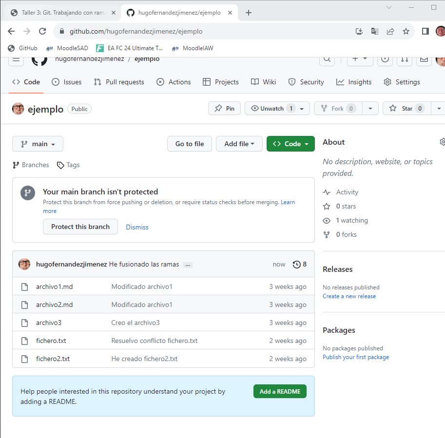
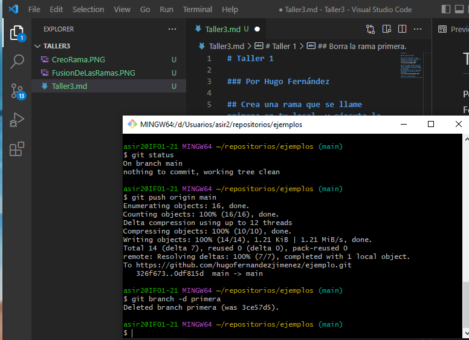
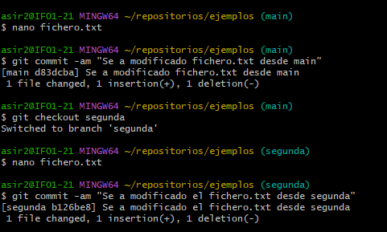
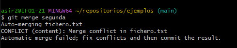
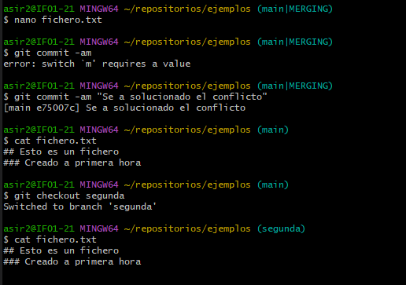
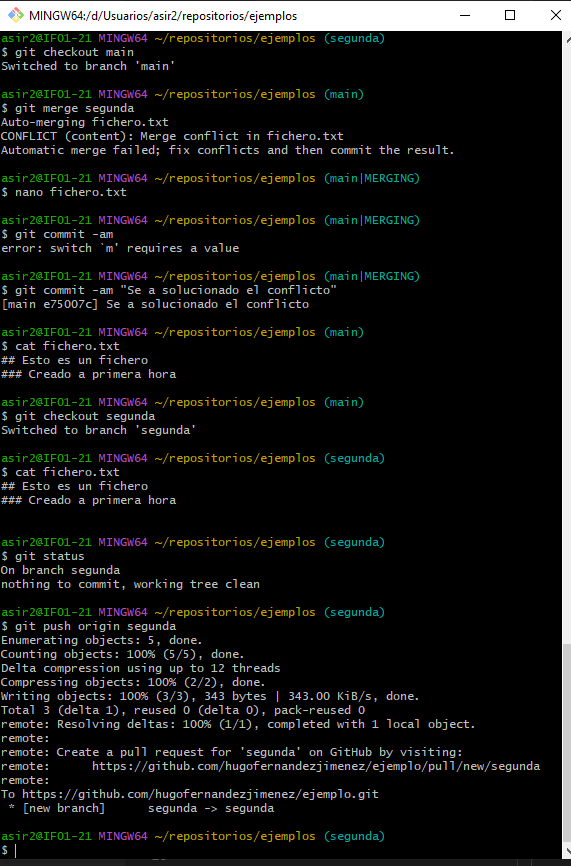
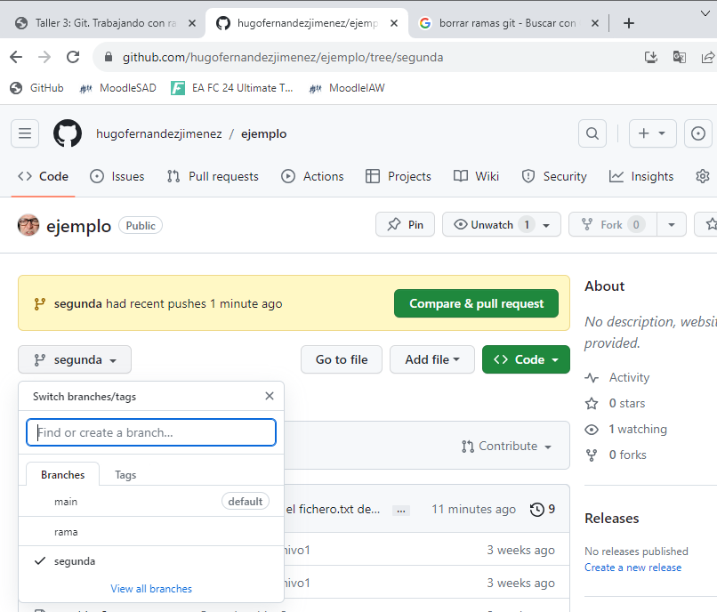

# Taller 1

### Por Hugo Fernández  

## Crea una rama que se llame primera en tu local, y ejecuta la instrucción necesaria para comprobar que se ha creado.
  

## Crea un nuevo fichero en esta rama y fusiónalo con la principal. ¿Se ha producido conflicto? Razona la respuesta.
### Al fusionarlo con la principal se producio un conflicto pero lo solucione:

## Borra la rama primera.

## Crea una rama que se llame segunda, y modifica un fichero en ella para producir un conflicto al unirlo a la rama principal. Entrega el contenido del fichero donde se ha producido el conflicto.

## Modifico los ficheros desde  main y desde segunda haciendo commit -am desde las 2 ramas:

## Hacemos el git merge:

## Pero da conflicto

## Modifico el fichero desde main para solucionar el conflicto:

## Hacemos push:

