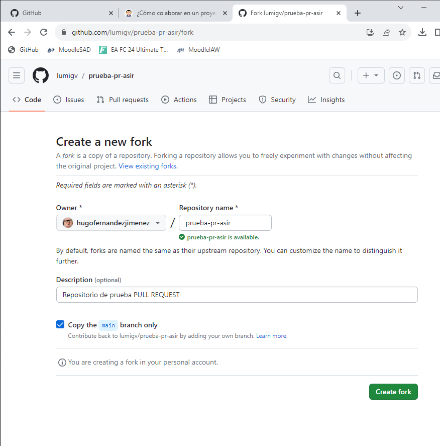
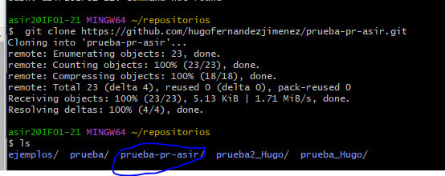
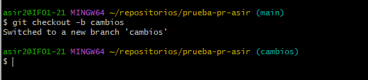
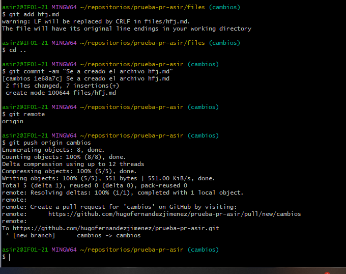
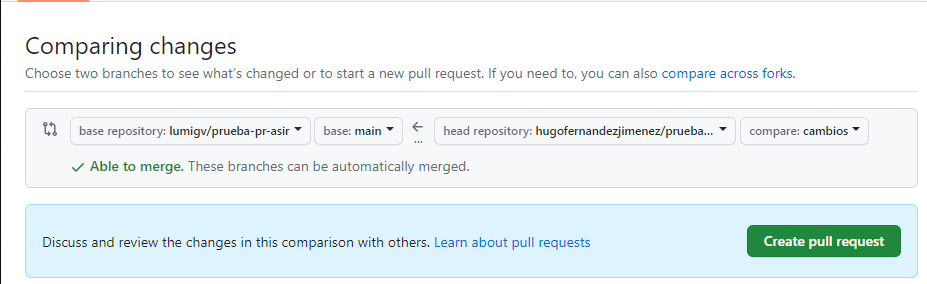
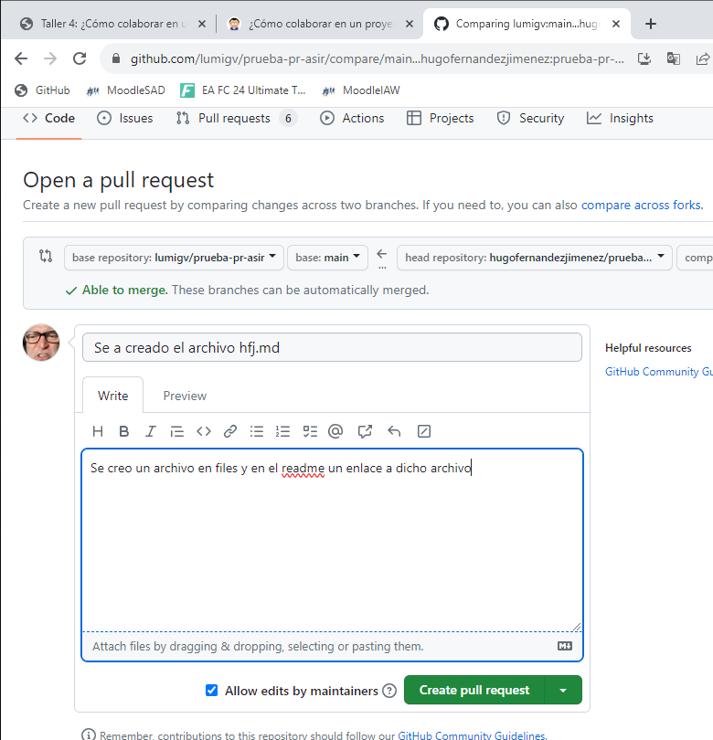
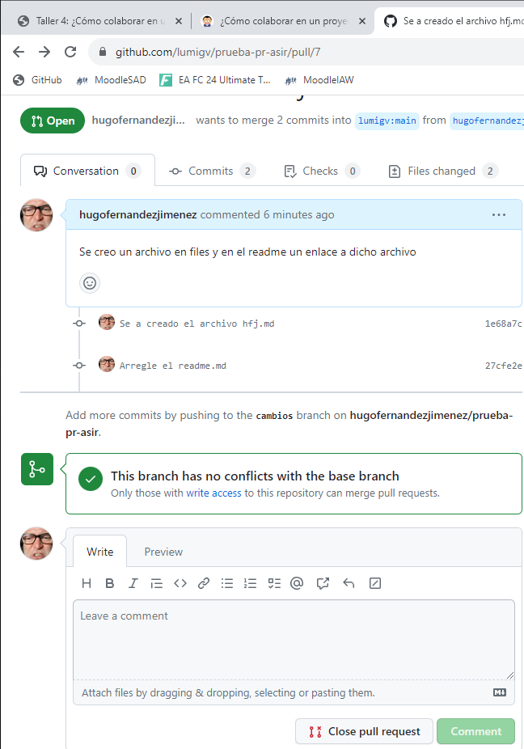

# Taller 4 Hugo Fernández Jiménez

## Paso 1
### Hacemos el fork:

## Paso 2
### Clono repositorio

## Paso 3
### Creo la rama cambios

## Paso 4
### Modifico el readme

## Paso 5
### Creo el fichero hfj.md y mofifico el readme.md:

## Paso 6
### Desde el repositorio online hago el pull request:

## Paso 7
### Estaria acabado:
