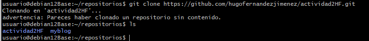
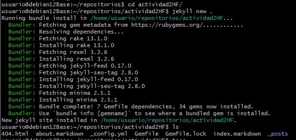
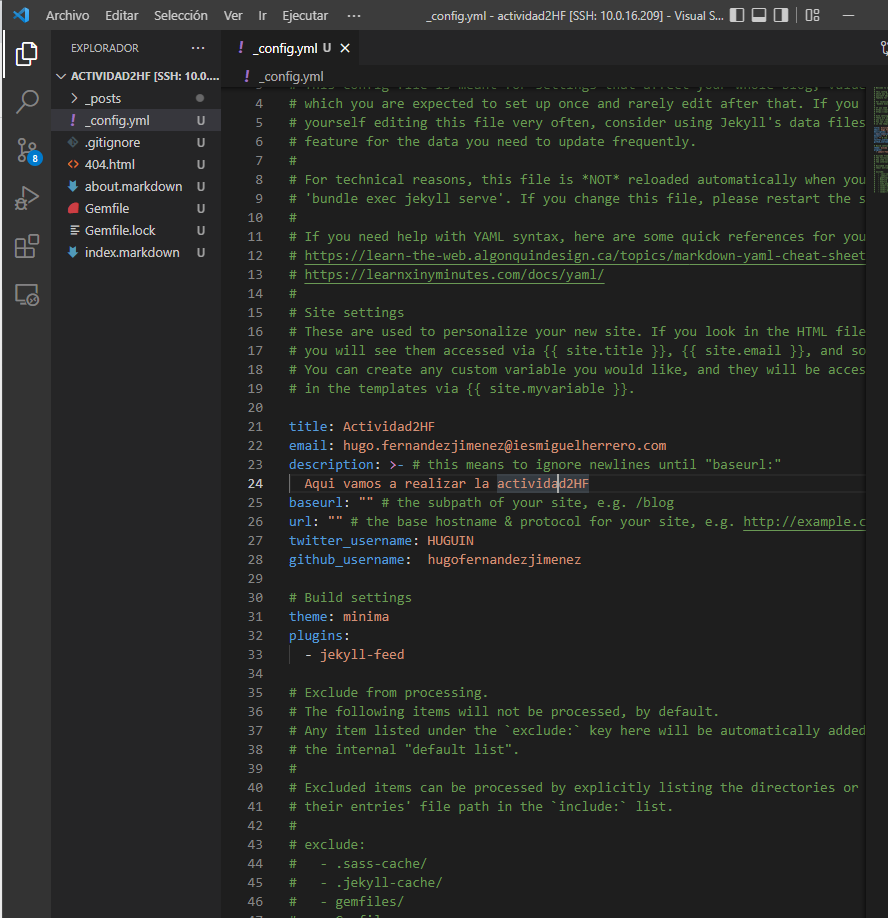
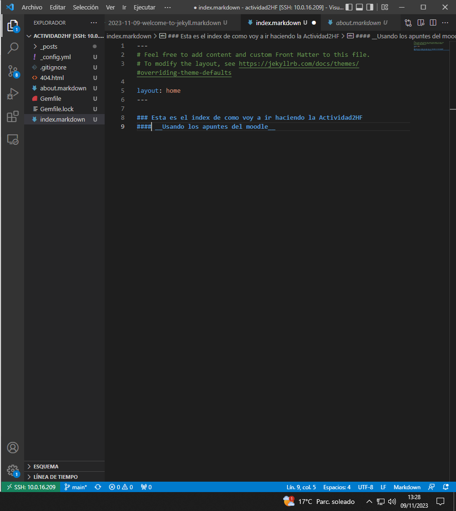
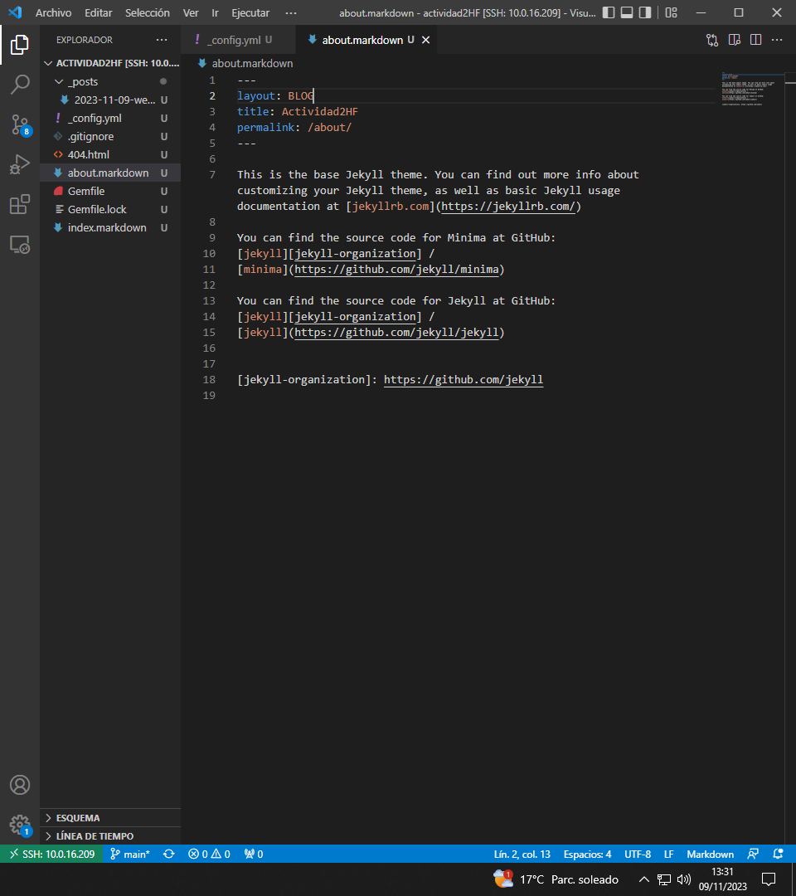

# Actividad 2
## 1. Creamos el repositorio en github:

## 2. Clonamos el repositorio desde la maquina debian:

## 3. Arrancamos la página jekyll:

## 4. Configuramos el config.yml:

## 5. Modifico el index:

## 6. Modifico el about.markdown:

## 7. Subo la página jekyll usando la dirección de la maquina virtual debian y el puerto 3000:

